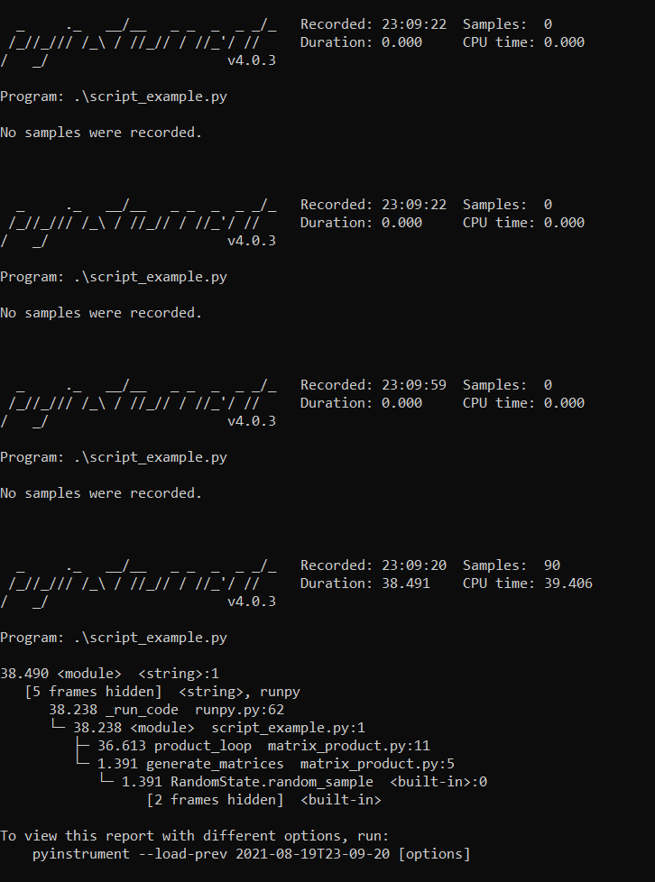

# Pyinstrument

Folder to keep track of experiments to assess
[**pyinstrument**](https://pyinstrument.readthedocs.io/en/latest/index.html#)

* The following snapshot captures the output of pyinstrument after executing `pyinstrument .\script_example.py`

